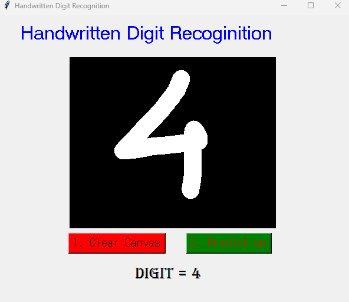

# Digit-Recognition
- Building a digit recognizer model with the help of MNIST dataset
- With a digital slate to work real-time
- Using tkinter for the UI

Download My App{:gui.exe}

The application looks as follow:\
